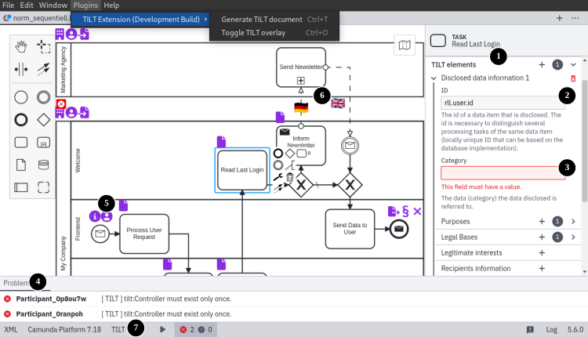
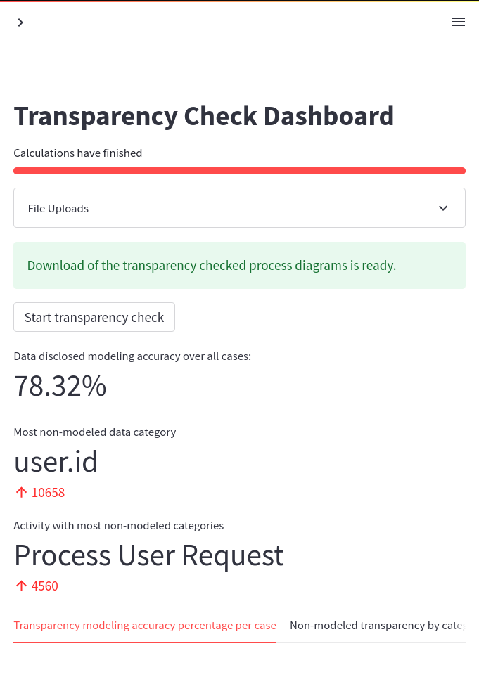
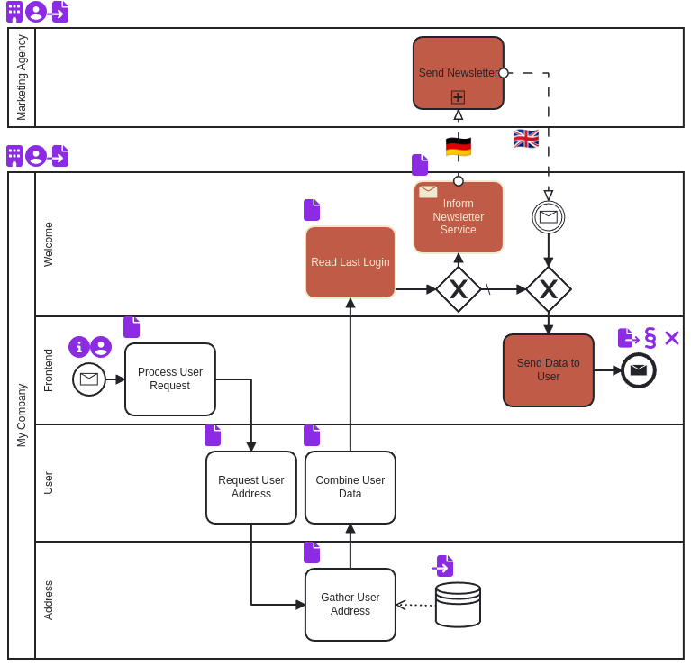

# Extending BPM with transparency information
This is the top-Level repository that overarches the contributions of the "Extending BPMN for regulatory transparency compliance" master thesis.

## Repository Contents
This repository contains the following submodules:

1. [Modeler Plugin](https://github.com/ciphersmaug/tilt-camunda-plugin/)
2. [Logging Descriptor](https://github.com/ciphersmaug/process_tilt_logger)
3. [Transparency logging microservice architecture example](https://github.com/ciphersmaug/transparency-logging)
    - [Transparency Dashboard](https://github.com/ciphersmaug/transparency-logging/tree/main/src/mining-dashboard)
    - [Demo Data](https://github.com/ciphersmaug/transparency-logging/tree/main/src/mining-dashboard/app/data/)

## Contribution Overview
### Camunda Modeler TILT Plug-in
Click on the following image to view an instruction video or view the video here: https://youtu.be/Uxc8UhvdOSc

Contents:
- 0:00 Plug-In Installation
- 2:27 Basic transparency property editing
- 4:53 Transparency modeling
- 7:24 Transparency problem resolving
- 9:41 Transparency modeling assistance
- 13:16 Transparency icon overlay
- 14:29 TILT Document creation

### Transparency Logging Microservice Architecture Example

### Process Transparency Dashboard

|Dashboard|Transparency Checked Process|
|---|---|
|||